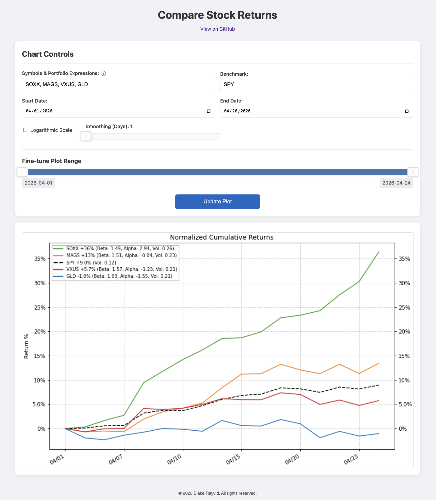

# Compare Stock Returns

A Flask web app to compare the historical returns of publicly traded securities and custom portfolios against a benchmark.

View the project here: **[stocks.blakerayvid.com](https://stocks.blakerayvid.com)**

## Features

*   **Compare Multiple Assets:** Plot the performance of individual stock symbols (e.g., `GOOGL, AAPL, MSFT`).
*   **Create and Compare Rebalanced Portfolios:**
    *   **Equal-Weighted:** `e.g. (AAPL, GOOG, MSFT)`
    *   **Custom-Weighted:** `e.g. (0.6*SPY, 0.4*TLT)`
    *   **Partially-Weighted:** Create portfolios where unassigned tickers automatically split the remaining weight (e.g., `(0.5*VTI, VOO, QQQ)`).
*   **Quarterly Rebalancing:** All portfolios are rebalanced to their target weights at the beginning of each calendar quarter.
*   **Set a Benchmark:** Compare performance against a benchmark symbol (e.g., SPY for S&P 500).
*   **Interactive Controls:**
    *   Select a date range for data download.
    *   Fine-tune the plotted date range using an interactive slider.
    *   Apply a smoothing moving average to the plot lines.
    *   Toggle a logarithmic scale for the y-axis.
*   **Performance Metrics:** The legend displays total return, Beta, and Alpha relative to the benchmark.
*   **Efficient & Fast:** Caching of downloaded data speeds up subsequent requests.

## Tech Stack

*   **Backend:** Python, Flask
*   **Data Retrieval:** `yfinance`
*   **Data Handling:** `pandas`, `numpy`
*   **Plotting:** `matplotlib`
*   **Frontend:** HTML, CSS, JavaScript
*   **UI Components:** noUiSlider
*   **Caching:** `Flask-Caching`

## Project Structure

```
stock-returns/
├── app.py             # Main Flask application logic
├── static/            # Static files (CSS, JS, images)
│   └── favicon.ico
├── templates/         # HTML templates
│   └── index.html
├── requirements.txt   # Python dependencies
└── README.md          # This file
```

## Setup and Installation

1.  **Clone the repository:**
    ```bash
    git clone https://github.com/brayvid/stock-returns.git
    cd stock-returns
    ```

2.  **Create and activate a Python virtual environment:**
    ```bash
    python3 -m venv .venv
    source .venv/bin/activate  # On Windows: .venv\Scripts\activate
    ```

3.  **Install dependencies:**
    ```bash
    pip install -r requirements.txt
    ```

## Running the Application

1.  **Ensure your virtual environment is activated.**
2.  **Run the Flask development server:**
    ```bash
    python app.py
    ```
3.  **Open your web browser** and navigate to `http://127.0.0.1:5001/`.

## How to Use

1.  **Enter Symbols & Portfolios:** In the main input field, enter comma-separated assets or portfolios.
    *   **Single Assets:** `AAPL, MSFT, GOOGL`
    *   **Equal-Weighted Portfolio:** `(NVDA, AMD, INTC)`
    *   **Custom-Weighted Portfolio:** `(0.6*SPY, 0.4*TLT)`
    *   **Mixed Input:** `(GOOG, AAPL), TSLA, SPY`

2.  **Set a Benchmark:** Provide a benchmark symbol (e.g., `SPY`).

3.  **Select Date Range:** Choose the start and end dates for the historical data.

4.  **Click "Update Plot":** Fetches data and generates the performance chart.

5.  **Fine-tune & Adjust:** Use the sliders and checkbox to adjust the plotted date range, apply smoothing, or switch to a log scale. The plot will update automatically.

---
<br>

