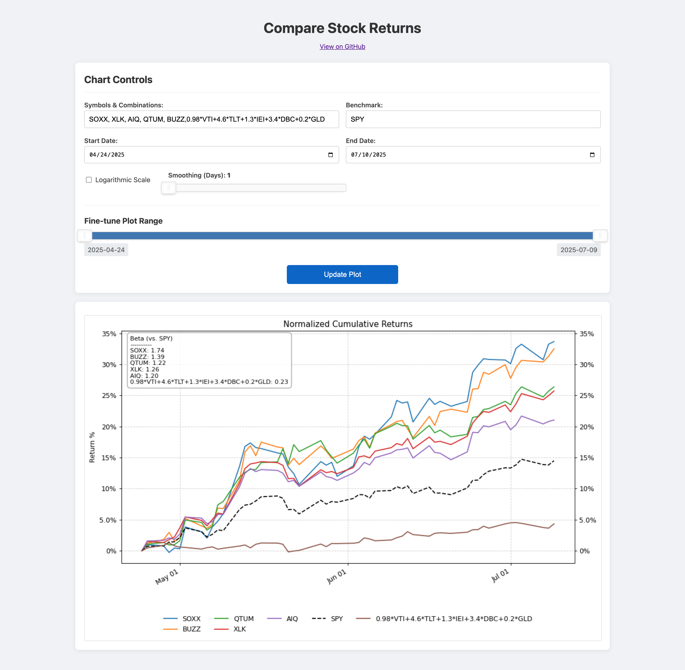

# Compare Stock Returns

A Flask web app to download, analyze, and compare the historical returns of publicly traded stocks against a benchmark.

View the project here: **[stocks.blakerayvid.com](https://stocks.blakerayvid.com)**

## Features

*   Compare multiple stock symbols (e.g., GOOGL, AAPL, MSFT).
*   Set a benchmark symbol (e.g., SPY for S&P 500).
*   Select an overall date range for data download.
*   Fine-tune the plotted date range using an interactive slider.
*   View normalized cumulative returns.
*   Option to view returns on a logarithmic scale.
*   Data downloaded from Yahoo Finance via the `yfinance` library.
*   Caching of downloaded data to speed up subsequent requests.
*   Responsive design for usability on different screen sizes.

## Tech Stack

*   **Backend:** Python, Flask
*   **Data Retrieval:** `yfinance`
*   **Data Handling:** `pandas`, `numpy`
*   **Plotting:** `matplotlib` (rendered to an image)
*   **Frontend:** HTML, CSS, JavaScript
*   **UI Components:** noUiSlider (for the date range slider)
*   **Caching:** `Flask-Caching`

## Project Structure

```
flask_stock_app/
├── app.py             # Main Flask application logic
├── static/            # Static files (CSS, JS, images)
│   └── favicon.ico
├── templates/         # HTML templates
│   └── index.html
├── requirements.txt   # Python dependencies
└── README.md          # This file
```

## Setup and Installation

1.  **Clone the repository (if applicable):**
    ```bash
    git clone https://github.com/brayvid/compare-stock-returns.git
    cd compare-stock-returns
    ```

2.  **Create a Python virtual environment:**
    It's highly recommended to use a virtual environment to manage dependencies.
    ```bash
    python3 -m venv venv
    source venv/bin/activate  # On Windows: venv\Scripts\activate
    ```

3.  **Install dependencies:**
    ```bash
    pip install -r requirements.txt
    ```

## Running the Application

1.  **Ensure your virtual environment is activated.**
2.  **Run the Flask development server:**
    ```bash
    flask run
    ```
    Alternatively, if your `app.py` has `if __name__ == '__main__': app.run(debug=True)`, you can run:
    ```bash
    python app.py
    ```
3.  **Open your web browser** and navigate to `http://127.0.0.1:5000/`.

## How to Use

1.  **Enter Stock Symbols:** In the "Stock Symbols" field, enter comma-separated ticker symbols (e.g., `AAPL,MSFT,GOOGL`).
2.  **Enter Benchmark Symbol:** Provide a benchmark symbol (e.g., `SPY`).
3.  **Select Overall Date Range:** Choose the start and end dates for the historical data you want to download.
4.  **Logarithmic Scale (Optional):** Check the "Logarithmic Scale" box if you prefer to view returns on a log scale.
5.  **Click "Update Plot":** This will fetch the data and generate the initial plot.
6.  **Fine-tune Plotted Date Range:** Use the double-handled slider above the plot to zoom into specific periods within the downloaded data range. The plot will update automatically (or upon clicking "Update Plot" again, depending on implementation choices for the slider's effect).


---
<br>

